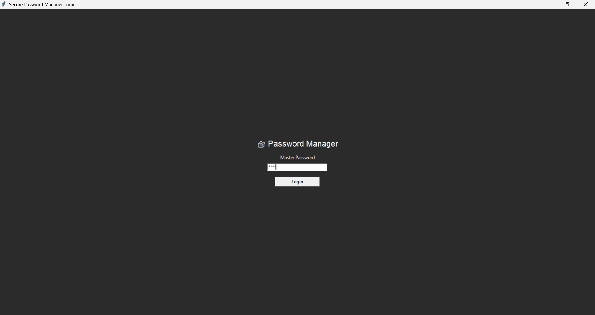

# 🔐 Secure Password Manager

A secure desktop password manager built with **Python and Tkinter** that allows users to safely store and manage credentials using **AES encryption**.
This application helps users generate strong passwords, store them securely, and access them easily through a simple graphical interface.

---

## 🚀 Features

* 🔑 Master password authentication
* 🔐 AES encrypted password storage
* ⚡ Generate strong and random passwords
* 🔎 Search saved credentials
* 📋 Copy passwords quickly
* 💻 User-friendly graphical interface

---

## 🛠 Tech Stack

* **Python**
* **Tkinter (GUI)**
* **Cryptography Library (AES Encryption)**
* **JSON (Data Storage)**

---

## 📸 Application Preview

### Login Screen



Password Manager Dashboard
.

---

## ⚙️ Installation

Clone the repository:

```
git clone https://github.com/iamsonam08/secure-password-manager.git
```

Go to the project folder:

```
cd secure-password-manager
```

Install dependencies:

```
pip install cryptography
```

Run the application:

```
python login.py
```

---

## 🔮 Future Improvements

* Cloud synchronization
* Two-factor authentication
* Web-based password manager
* Browser extension support
* Backup and restore feature

---

## 👩‍💻 Author

**Sonam Yadav**

GitHub:
https://github.com/iamsonam08
