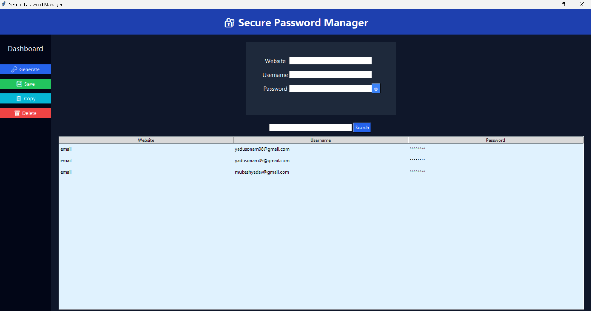

# 🔐 Secure Password Manager


A **secure desktop password manager** built using **Python and Tkinter** that allows users to store and manage credentials safely using **AES encryption**.

This application helps users generate strong passwords, securely store login credentials, and retrieve them easily using a simple graphical interface.

---

# 🚀 Features

* 🔑 Master password authentication
* 🔐 AES encrypted password storage
* ⚡ Generate strong passwords
* 🔎 Search saved credentials
* 📋 Copy passwords quickly
* 🗑 Delete stored credentials
* 💻 Clean and simple GUI interface

---

# 🛠 Tech Stack

* Python
* Tkinter (GUI)
* Cryptography Library (AES Encryption)
* JSON (Data Storage)

---

# 📸 Application Preview

### Login Screen


### Password Manager Dashboard



---

# ⚙️ Installation

Clone the repository:

```bash
git clone https://github.com/iamsonam08/secure-password-manager.git
```

Go to the project folder:

```bash
cd secure-password-manager
```

Install dependencies:

```bash
pip install cryptography
```

Run the application:

```bash
python login.py
```

---

# 🔮 Future Improvements

* Cloud synchronization
* Two-factor authentication
* Web-based password manager
* Browser extension support
* Backup and restore feature

---

# 📂 Project Structure

```
secure-password-manager
│
├── login.py
├── main.py
├── encryption.py
├── gui_password_manager.py
├── README.md
└── .gitignore
```

---

# 👩‍💻 Author

**Sonam Yadav**

GitHub:
https://github.com/iamsonam08
